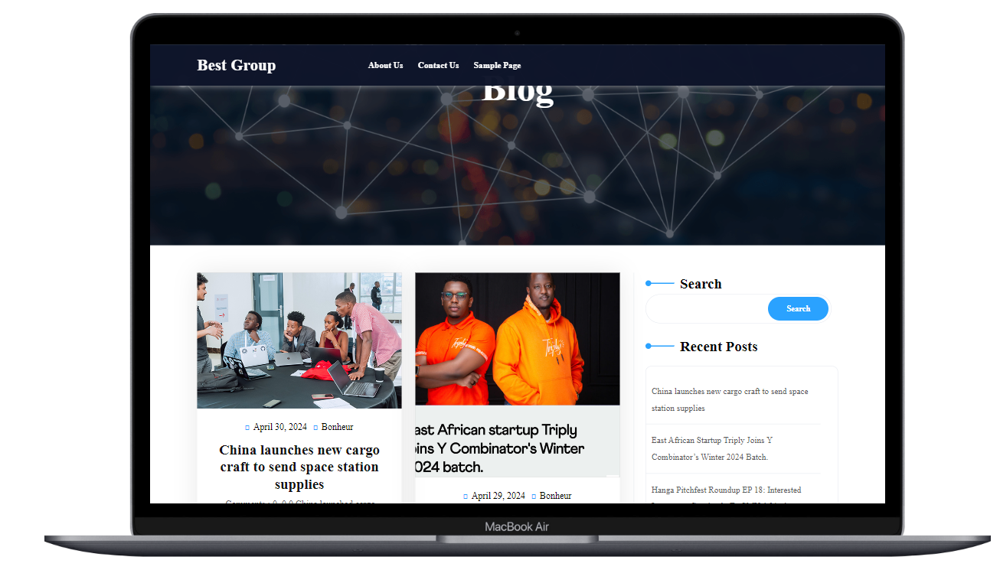
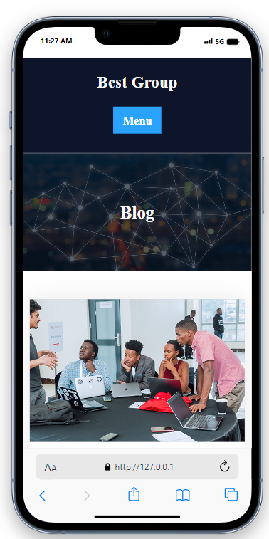
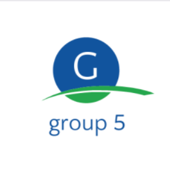

# group 4

by focusing on CMS our group has created blogs website where admin user will create blog with full information blog that have created 

# Group members  

| No | Names | Reg Number |
| -------- | -------- | -------- |
| 1   | Bonheur IRAGUHA   | 223006806   |
| 2   | INEZA Nadege   | 223010131   |
| 3   | UMUMARARUNGU Nadia   | 223012252   |
| 4   | ISIMWE Emmanuel   | 223020753   |
| 5   | TETA Deborah   | 223000947  |
| 6   | WAMAHIRWE Francine   | 222023570  |

# Technologies used
- **CMS**: [wordpress](https://wordpress.org/)
- **Database**: [PHP Myadmin, SQL](https://www.phpmyadmin.net/)
- **Theme**: [Ideal Blog](https://wordpress.org/)
- **Main plagin**: [Elementor](https://wordpress.org/)
- **Host**: [Localhost](http://127.0.0.1/dashboard/)

# desriptions
Welcome to Best Group, your premier destination for all things [topic/industry/niche]. Our engaging articles, expert analysis, and vibrant community make us the perfect companion for your journey in [topic/industry/niche]. Subscribe now and join us in exploring, learning, and connecting.

# Demo

# main features 
- **searching feature**
- **search by tag, dat, write, and category**
- **flitter Feature**
- **User will be able to comment on post after reading**

# conclusion

Thank you for exploring Best Group with us. We hope this README has provided you with valuable insights into our project's purpose, features, and usage. Whether you're a developer, contributor, or user, we welcome your feedback, contributions, and ideas.

If you have any questions or suggestions, please don't hesitate to reach out to us. We look forward to collaborating with you and continuing to improve Best Group together.

Happy connecting!

